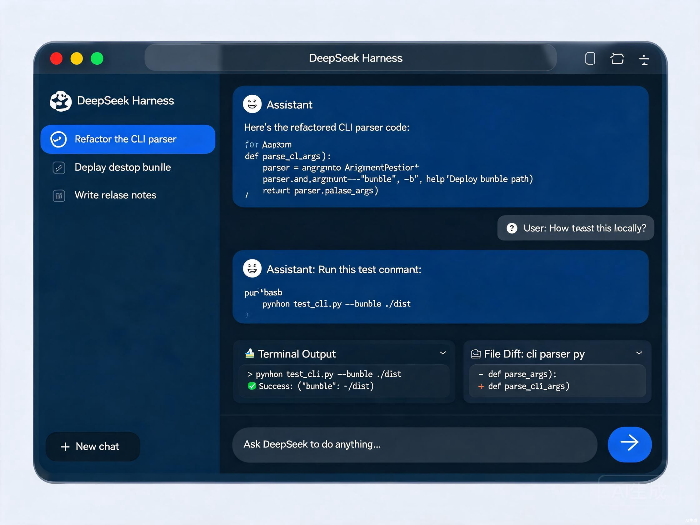

# DeepSeek Harness Desktop

English | [中文](README.zh.md)

A desktop application built on [DeepSeek Harness](https://github.com/deepseek-ai/deepseek-harness) (`dsh`), the open-source plugin-based agent harness. It wraps the service startup, runtime management, and the browser surface into an out-of-the-box Electron window — you need neither Node.js nor a shell command to run the agent.

Under the hood, everything is still a plugin on [Cordis](https://github.com/cordiverse/cordis). The desktop shell only changes the carrier: the host process and the renderer share one Cordis instance, and an IPC fetch bridge replaces HTTP, so no server process and no LAN socket are left behind.



## Highlights

- **Zero-configuration desktop window** — the app bundles the full host runtime, so it opens ready to use.
- **One shared runtime** — host and plugin tree run in a single Cordis instance with one profile and one data directory.
- **No server, no open socket** — the renderer talks to the host over a private loopback-equivalent IPC bridge (`dsh://` opaque origin), not `127.0.0.1:3080` HTTP.
- **Everything is a plugin** — the entire harness, including tools, skills, and capabilities, remains the configurable plugin tree you already use with `dsh`.
- **Cross-platform** — unsigned macOS arm64/x64 (dmg, zip) and Windows x64 (NSIS, zip) artifacts.

## Requirements

A DeepSeek API key, configured in the application settings on first launch. The harness reads it through the standard credentials path; CI and headless use read `DEEPSEEK_API_KEY`, and the desktop settings surface stores it for the app.

## Install

Desktop artifacts are produced by the repository's [Build desktop workflow](.github/workflows/build-desktop.yml) and uploaded as GitHub Actions artifacts, one per platform:

| Platform | Arch | Downloads | Artifact |
|---|---|---|---|
| macOS | arm64 | dmg, zip | `DeepSeek-Harness-<version>-mac-arm64` |
| macOS | x64 | dmg, zip | `DeepSeek-Harness-<version>-mac-x64` |
| Windows | x64 | NSIS, zip | `DeepSeek-Harness-<version>-win-x64` |

The app bundles a full host closure plus the Electron runtime; expect roughly 250–350 MB per artifact.

### Unsigned artifacts

Local and CI artifacts are **unsigned**. On macOS, Gatekeeper blocks a downloaded app — right-click → *Open*, or move it to Applications and open once. On Windows, SmartScreen shows "Windows protected your PC" — choose *More info* → *Run anyway*. Code signing, notarization, and auto-update are deferred follow-up work.

## Build from source

```sh
git clone https://github.com/Gakiwoo/deepseek-harness-application.git
cd deepseek-harness-application
pnpm install
pnpm run build:lib
pnpm run pack:desktop
```

This deploys the host closure into `apps/desktop/resources/host`, builds the desktop-mode frontend, bundles the shell, rebuilds `node-pty` against the Electron ABI, and runs electron-builder. Artifacts land in `apps/desktop/dist/`, selected by `DSH_DESKTOP_ARCH` when set.

For a live development loop instead of a packaged app, run `pnpm run dev:desktop`.

## Documentation

- [Desktop app](docs/subsystems/desktop-app.md) — the desktop subsystem contract and carrier layering.
- [Architecture](docs/architecture.md) — how the plugin-based harness is composed.
- [Development](docs/development.md) — contributor setup and daily workflow.

For agents working in this repository, follow [AGENTS.md](AGENTS.md).

## License

[MIT](LICENSE)

Third-party dependencies and their licenses are disclosed in [THIRD_PARTY_NOTICES.md](THIRD_PARTY_NOTICES.md).